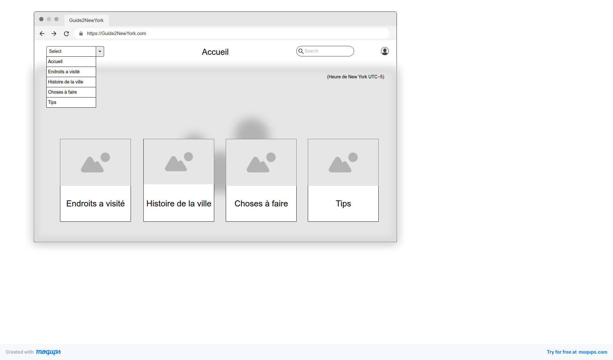
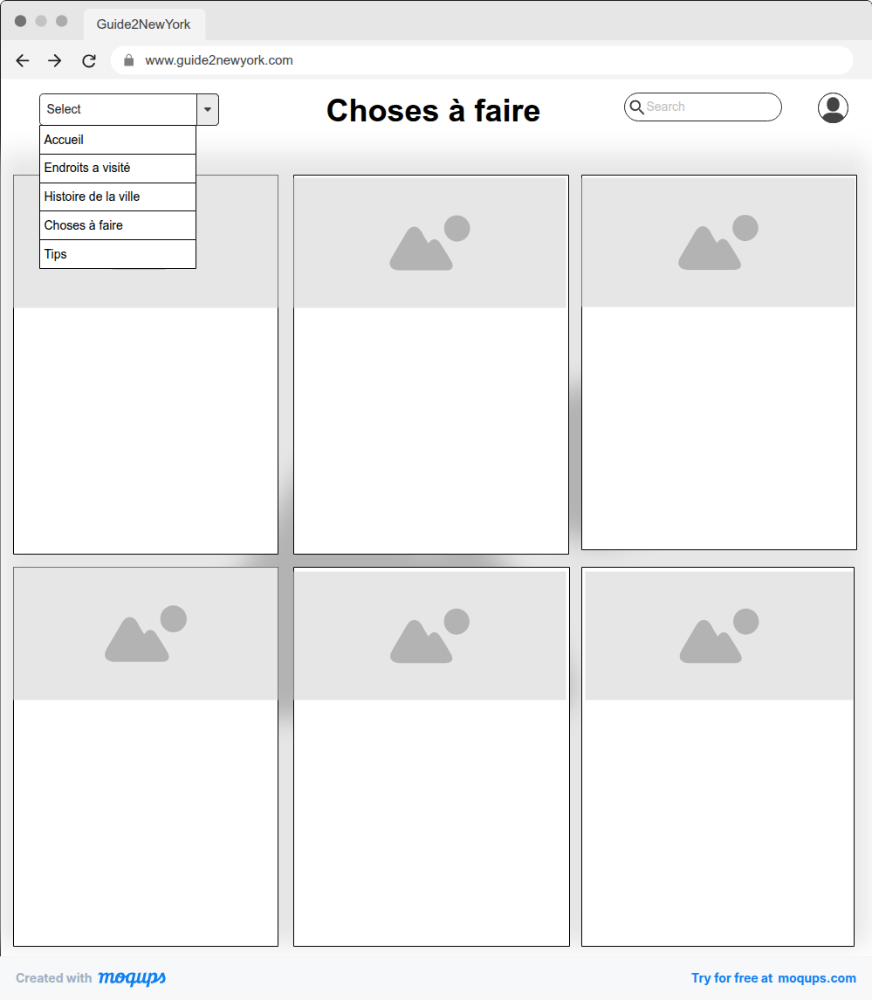
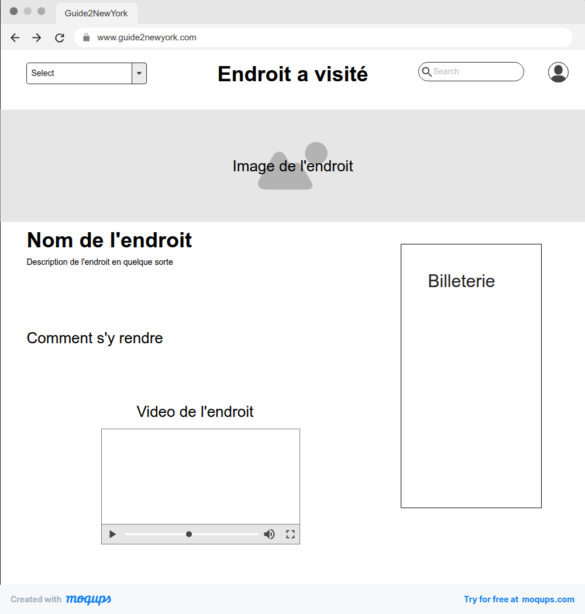
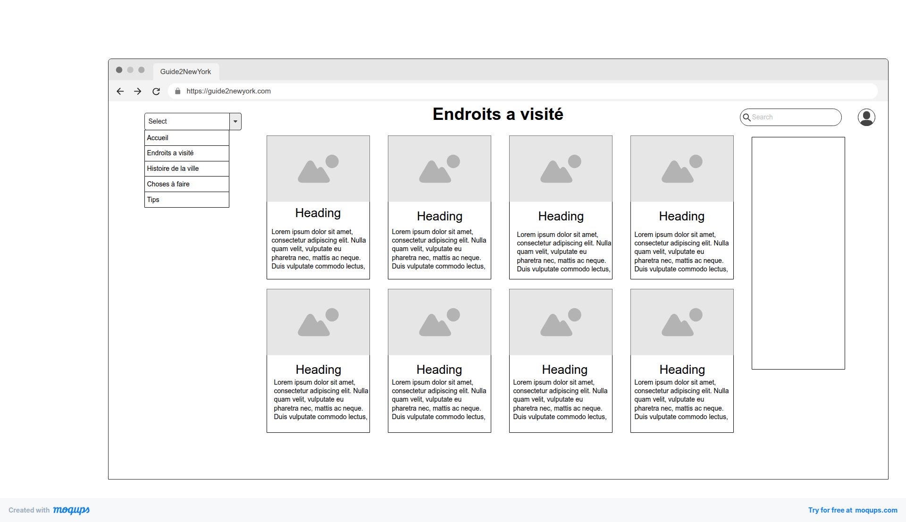

# Module 293 : Projet Personnel
Luthi Ethan

## Nom du projet

Guide2NewYork

## Lien url sur l'hébergement
_Lien permettant d'accéder directement à votre site hébergé_

## Introduction 
_Explication du choix du sujet et pourquoi ce choix_

J'ai choisi ce sujet car je suis déjà allé à New York et c'est une ville que j'ai beaucoup aimé. Et car je voulais + m'informer sur la ville
## Les objectifs du site 
_Quelle est l’utilité du site? Quel est le public cible?_ 

Utilité : son utilité est qu'il donne des infos sur les endroits a visité les choses a faire ainsi que sur l'histoire de la ville

Public cible : Les locaux tout comme les touristes ou bien les gens qui veulent juste s'informer sur la ville et son histoire

### Personas
### Diagramme de use case
## Les articles 
_Liste des (minimum) 5 pages et résumé rapide de leur contenu_
- Page 1: Accueil (page d'accueil du site qui contient une image et la description du site en gros)
- Page 2: les endroits a visité (nom d'endroits a visité "incontournabke" avec  description et adresse)
- Page 3: L'histoire de la ville (Paragraphe sur l'histoire avec des images)
- Page 4: Les choses/activités a faire (les activités avec leurs adresse date lieu ect..)
- Page 5: les Tips

## Les maquettes
_Un schéma qui identifie les pages : titre du contenu principal, ainsi que la navigation entre les pages. Maquette version mobile et Desktop_

     

## Les technologies 
_Identification des technologies utilisées dans le projet_

## Tests 
_Liste des tests réalisés pour l'ergonomie du site, la validation du site, de la compatibilité entre les navigateurs, technologies « exotiques »…_

_Ci-dessous un exemple. La première ligne est un exemple avant d'avoir effectué le test. La deuxième ligne est un exemple après avoir effectué le test positif. La troisième ligne est un exemple après avoir effectué un test pas opérationnel. La quatrième ligne est un exemple, mais doit être présente dans les tests technologiques._

| N° test | Description                            | Système | Connexion | Navigateur | Résultat attendu                                                                 | Résultat obtenu                                   | Résultat du test |
|--------:|-----------------------------------------|---------|-----------|------------|-----------------------------------------------------------------------------------|---------------------------------------------------|------------------|
| 1       | Affichage de la page d'accueil          | Win10   | Filaire   | Edge 89    | La page d'accueil s'affiche avec l'image au centre de l'écran                    |                                                   |                  |
| 2       | Affichage du menu mobile                | Android | Wifi      | Chrome 87  | Le menu mobile apparaît avec les 3 trois traits significatifs                    | Le menu mobile apparaît                           | 🟩               |
| 3       | Affichage de la page Histoire           | Mac     | Wifi      | Safari 14  | Tout le contenu de la page histoire est conforme à la maquette                   | Le texte du premier paragraphe est caché par le menu | 🟥               |
| 4       | Validation W3C page d'accueil           | -       | -         | -          | La page d'accueil est conforme W3C                                                |                                                   |                  |

## Conclusion personnelle
_Ce que j'ai aimé, et moins aimé au niveau du projet. Comment j'évalue mon travail et mon organisation_
