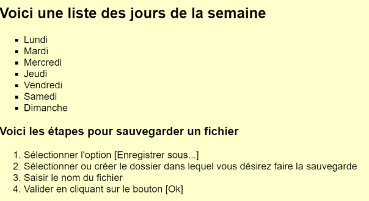
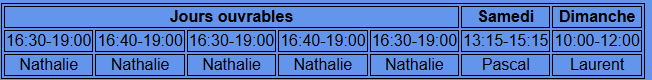
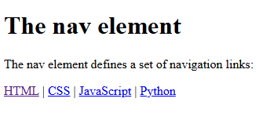
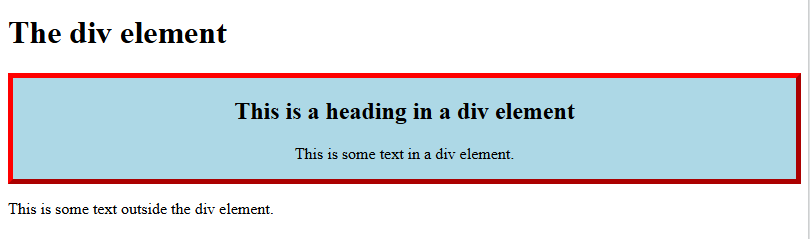
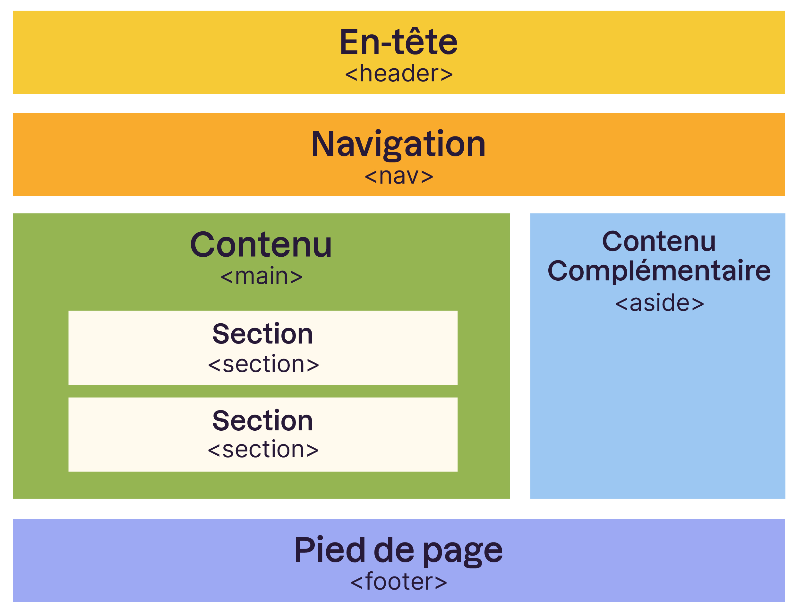
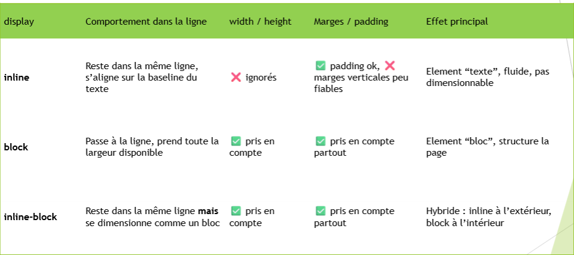
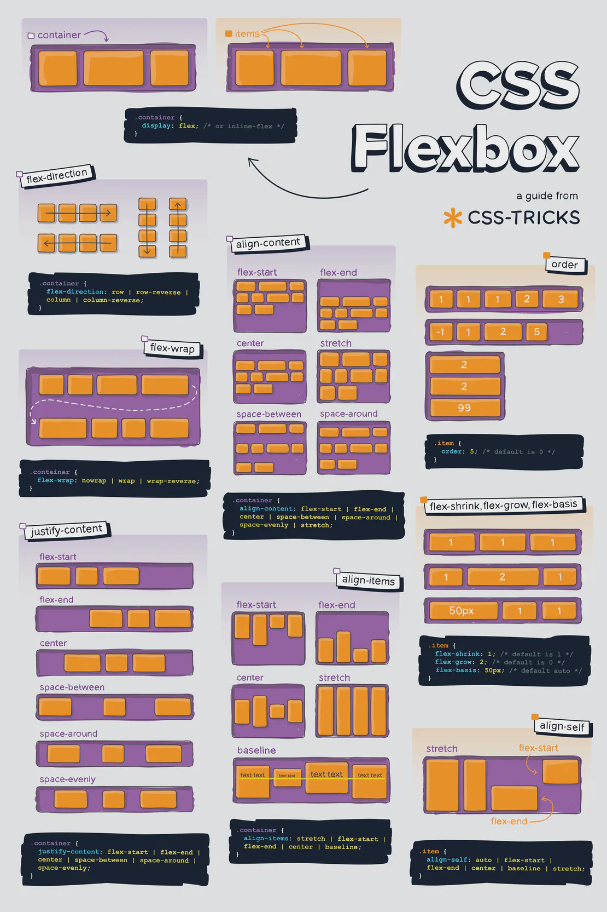

# Module 293 - Connaissances professionnelles

## Luthi Ethan

_Dans ce rapport, privilégiez des exemples concrets sous forme d'extraits de code formattés, accompagnés d'explications concises_
_Les éléments en italiques ne font pas partie de la table des matières, ils sont là uniquement à titre informatifs!_

## Introduction
### Introduction au module

### Objectifs du module

## HTML
### Présentation du langage et des concepts clés

Le langages html est un langage de code utilisé pour coder des sites web
### En-têtes des fichiers
```html
	<head>
	<style>
	h1 {font-family: Arial;}
	p {font-style: italic;}
	pre {color: red;}
	</style>
		<title>Balises principales en HTML</title>
		<meta charset_"utf-8">
	</head>
```
### Commentaires
Dans cet entête il y a plusieurs choses le titre,style et metadonné

Style : utilisé pour ajouter des style CSS a des éléments du code

Title : Est utilisé pour donné un titre a l'entête

Meta : sert aux métadonnées


### Squelettes d'une page HTML

```html
<!DOCTYPE html>
<html>

    <head>

	</head>

    <body>


    </body>


</html>
```


### Balises de base
_html, body, head, h1..h5, hr_

**html** : est comme la racine du code html il donne le début et la fin de celui-ci

```html
<html></html>
```

**head** : cette balise contient les styles,les métadonné,le titre d'en-tête

```html
<head></head>
```


**body** : c'est le corps du code il contient tous les paragraphes, titre, image,ect..

```html
<body></body>
```


**h1..h5** : il sont utilisé pour les difflrents titre dans le body(h1 est grand et plus le chiffre est haut plus le titre devient petit)

```html
<h1></h1>   <h2></h2>
```


**hr** : cette balise sert a "délimité" les différents éléments (elle ajoute une barre horizontal sur la page du site web)

```html
<hr>
```


### Balises d'organisation du contenu

#### Listes
_ul, ol, li_

**ul** : Unorganized list (Liste non origanisé c'est une liste avec des puces)
```html
<ul></ul>
```
**ol** : Organized list (liste organisé avec des chiffres)
```html
<ol></ol>
```
**li** : Sert a créer un nouveau point dans la liste
```html
<li></li>
```
### Exemple :
```html
<ul>
<li>Lundi</li>
<li>Mardi</li>
<li>Mecredi</li>
<li>Jeudi</li>
<li>Vendredi</li>
<li>Samedi</li>
<li>Dimanche</li>
</ul>

<h2> Voici les étapes pour sauvegarder un fichier</h2>

<ol>
<li>Sélectionner l'option [Enregistrer sous...]</li>
<li>Sélectionner ou créer le dossier dans leqeul vous désirez faire la sauvegarde</li>
<li>Saisir le nom du fichier</li>
<li>Valider en cliquant sur le bouton [OK]</li>
</ol>
```
**Image** : 


#### Tableau
_table, tr, td, th_

**Table** : Sert a créer le tableau (la racine)
```html
<table></table>
```
**tr** : table row(colonne du tableau)
```html
<tr></tr>
```
**th** : table header (c'est l'en-tête du tableau)
```html
<table>
<tr>
	<th></th>
</tr>
</table>
```
**td** : table cell (cellule du tableau)
```html
<table>
<tr>
	<th> <td></td> </th>
</tr>
</table>
```

***Exemple***
```html

      <table>
        <tr>
          <th colspan="5">Jours ouvrables</th>
          <th>Samedi</th>
          <th>Dimanche</th>
        </tr>
        <tr>
          <td>16:30-19:00</td>
          <td>16:40-19:00</td>
          <td>16:30-19:00</td>
          <td>16:40-19:00</td>
          <td>16:30-19:00</td>
          <td>13:15-15:15</td>
          <td>10:00-12:00</td>
        </tr>
        <tr>
          <td>Nathalie</td>
          <td>Nathalie</td>
          <td>Nathalie</td>
          <td>Nathalie</td>
          <td>Nathalie</td>
          <td>Pascal</td>
          <td>Laurent</td>
        </tr>
      </table>
```

***Image***


### Balises de structuration de page
_nav, div, header, footer, main, section, p, article, aside, blockquote_

**nav** : c'est un ensemble de lien de naviguation
```html
<nav>
<a href="link">Nom</a>
<a href="link2">Nom</a>
	</nav>
```
***Exemple de rendu***



**div** : divison dans un code html
```html
<!DOCTYPE html>
<html>
<head>
<style>
.myDiv {
  border: 5px outset red;
  background-color: lightblue;    
  text-align: center;
}
</style>
</head>
<body>

<h1>The div element</h1>

<div class="myDiv">
  <h2>This is a heading in a div element</h2>
  <p>This is some text in a div element.</p>
</div>

<p>This is some text outside the div element.</p>

</body>
</html>
```
***Exemple visuel***



**header** : cette balise sert comme a séparé l'introduction du reste d'un "article" c'est un peu comme une en-tête
```html
  <header>
    <h1>A heading here</h1>
    <p>Posted by John Doe</p>
    <p>Some additional information here</p>
  </header>
```
**footer** : il définit un pied de page pour un document ou une section
```html
<footer>
</footer>
```
**main** : cette balise spécifie le contenu principal du documents
```html
<main>
	</main>
```
**section** : définit une section dans un document
```html
<section>
	</section>
```
**p** : définit un paragraphe dans un document
```html
<p>
	</p>
```
**article** : contient un contenu indépendant qu'on peut reprendre et remettre dans une autre page web
```html
<article>
	</article>
```
**aside** : il définit un contenu qui n'a pas vraiment avoir avec le contenu dans lequel il est placé
```html
<aside>
	</aside>
```
**blockquote** : sert a faire des citations comme des sources
```html
<blockquote (cite="website")>
	</blockquote>
```

Schéma : 


### Balises de liens et médias
_a, img, audio, video_


**audio** : la balise "audio" sert a ajouter une piste audio au site

exemple de code :
```html
<audio controls>
  <source src="horse.mp3" type="audio.mpeg">
  Votre naviguateur ne supporte pas cet audio
</audio> 
```

**video** : la balise <video> sert a ajouter un contenu video au site
exemple : 

```html
<video width="320" height="240" controls>
  <source src="movie.mp4" type="video/mp4">
```

**a** : cette balise sert a implémenter un lien et a le "renommer" par autre choses
```html
<a herf="lien">"Par quoi on veut le renommer"</a>
```


**img** : cette balise sert a implémenté une image sur notre site web
```html

```


## CSS / SASS

### Présentation du langage CSS et des concepts clés

CSS = Cascading Style Sheets

Le languagues CSS sert à ajouter des styles tout en ayant un code organisé car les styles seront mis dans un autre fichier séparé du code


### Où déclarer le CSS

On le déclare dans le head comme ceci :

```html
<head>
<link rel="stylesheet" href="style.css">
    </head>
```

#### Inline

ça sert a mettre les éléments a la suite sur la même ligne

Exemple de code :

```css
p {
  display : inline;
}
```

#### block

les éléments block sont mis a la ligne suivante

```css
p {
  display : block;
}
```

#### inline-block
Se comporte comme un block à l'intérieur et a l'extérieur


(image de la présentation OneNote)

```css
p {
  display : inline-block;
}
```


#### En-tête <head>


#### Fichier 


### Sélecteurs
#### Balises

s'applique a toutes les balises de ce type :

Dans le fichier html :

```html
<p>gfdsghkjfdshgdf</p> <!-- sera bleu-->
<p>fdsgh397t54iu6ht54zgbkfln</p> <!-- sera bleu aussi -->
```

Dans le fichier css :

```css
p{
  color : blue;
}
```


#### Identifiants

Un ID est utilisé pour "mettre un style unique" a une balise (unique)

Dans le fichier html :

```html
<p id="idtest">Test</p>
```

Dans le fichier css :

```css
#idtest {
  font-family : Arial;
}
```


#### Classes

Une classe c'est comme une ID elle peut juste être utlisé plusieurs fois il est donc recommandé de l'utilisé contrairement a l'ID

Dans le fichier html :

```html
<p class="classtest">Test</p>
```

Dans le fichier css :

```css
.classtest {
  font-size : large;
}
```

### Autres

#### Pseudo classe :

Elle permet de définir un style ex : quand on passe la souris dessus le style changera c'est très intéressant si l'ont veut avoir un site assez interactif

Dans le fichier html :

```html
<a href="link">Nom</a> <!-- le liens sera vert quand on passera la souris dessus -->
```

Dans le fichier css :

```css
a:hover {
  color : green;
}
```

### Polices
### Unités et tailles


#### Unités relatives

Selon la taille de la police du 

#### Unités absolues


### Codification des couleurs
### Flexbox

FlexBox Poster 



Site web pour avoir des exemples interactif :
https://github.com/emf-info-25-26-3/module-293-flexbox-poster-Luthi-Ethan-EMF

### Mediaqueries
### Présentation du langage SASS et des concepts clés
## Javascript
### Présentation du langage JS et des concepts clés
## Validation / W3C
### Présentation du W3C
_Exemple : sa mission / le fondateur / principes de base / statut de l'organisation / quelques membres_

**Mission** : Le W3C est une organisation internationale qui établit les standards du Web pour garantir son accessibilité, son uniformité et son bon fonctionnement

 

**fondateur** : Tim Berners-Lee 


**principe de base** : ce sont des plans ou des blocs de construction d'un monde numérique


**statut de l'organistation** : Mondial

En quoi elle consiste : établir des standards web pour garantir son accèssiblité

**membres** : 

Adobe : car c'est connu

Amazon : la même choses

Discord : car c'est aussi connu

Duck Duck GO : car c'est un naviguateur internet

Google : naviguateur internet

Mastercard : car c'est utilisé pour les cartes bancaire

Meta : car c'est très connu

Microsoft : car c'est connu et important de le mentionné


### Outil de validation
_validateur W3C_
## Publication
### Protocole
### Serveur Web
### Outils de publication
### Droit d'auteur
#### Definiton
c'est une protection sur les oeuvres/logiciel de quelqu'un

#### élément protégé

livre 

peinture 

chanson 

image 

films 

photo 

logiciel 

#### Comment protéger une oeuvre :
Elle est protégé automatiquement à sa création

#### Combien de temps une oeuvre/logiciel est protégé en générak
**oeuvres** :
70 ans après la mort de son auteur 

**logiciel** :
50ans après le décès

## Conclusion

## Lexique

## Source

https://www.kmu.admin.ch/kmu/fr/home/savoir-pratique/gestion-pme/propriete-intellectuelle/marques-brevets-designs-droit-auteur%20/droit-auteur.html

https://www.ige.ch/fr/propriete-intellectuelle/guide-pour-innovateurs-et-creatifs/le-droit-dauteur

https://www.w3.org/standards/

https://www.w3.org/standards/

https://www.w3c.fr/a-propos-du-w3c-france/la-mission-du-w3c/

https://www.w3.org/membership/list/

https://www.w3schools.com/html/default.asp

https://eduetatfr.sharepoint.com/teams/EMF-C-INFOF13/_layouts/15/Doc.aspx?sourcedoc={9062af64-31d2-4d06-98ad-505dd63be9b5}&action=view&wd=target%28_Biblioth%C3%A8que%20de%20contenu%2F293.one%7Cbb73babd-9bca-45e2-b636-21cb849d326c%2FCSS%7C2590828c-dcb0-433b-b40b-d8d1645f6fb9%2F%29&wdorigin=NavigationUrl